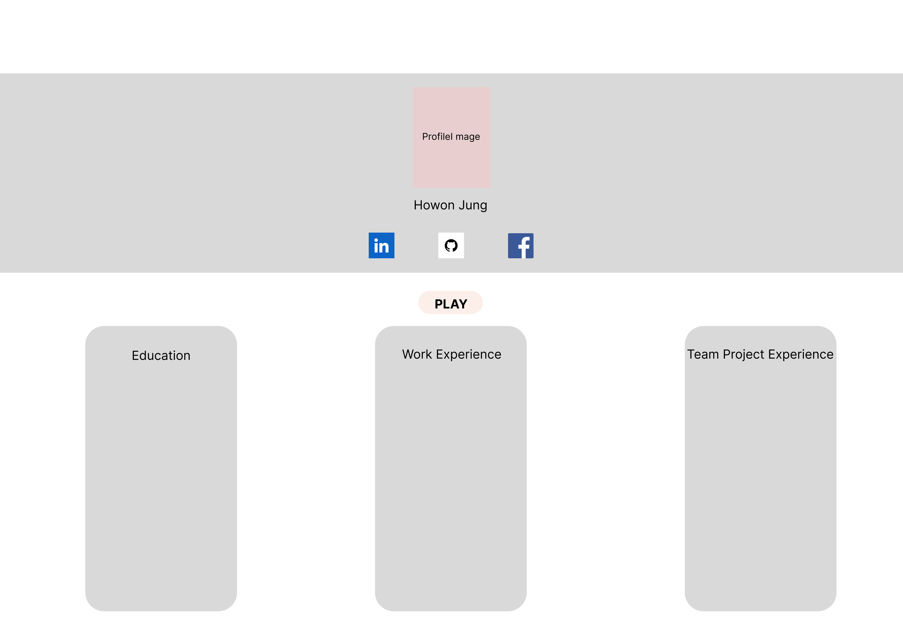
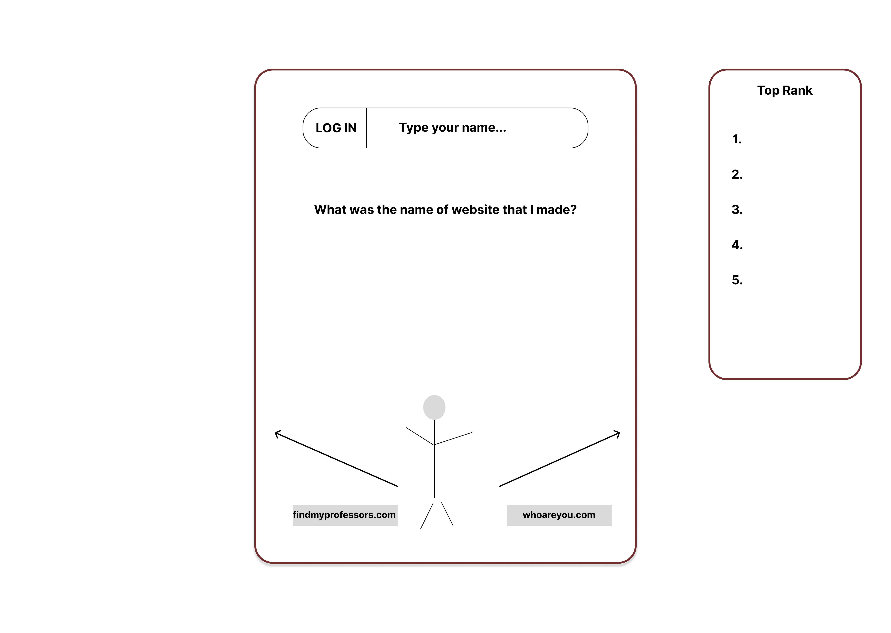

[Link to Notes](./notes.md)

# **Portfoilo Website**

## **Specification Deliverable**

### **Elevator pitch**

Imagine exploring a portfolio that’s not just a static resume, but an interactive experience! My personal website showcases my skills, projects, and achievements in a fresh and engaging way. Beyond just reading about my journey, visitors can dive into a fun, simple maze mini-game that brings my story to life. Whether it's trying to get out of maze with the information from protfolio, this interactive element keeps you engaged while learning more about me. It’s more than just a resume – it’s a unique way to connect with my professional journey!

### **Design**

### **Key features**
- Secure login over HTTPS for maze game
- Ability to select the buttons for game
- Display of portfolio infromation
- Ability to choose the one option out of two go forward maze
- Display total time that they took to finish the game
- Top 5 ranks from game will be saved

### **Technologies**

I am going to use the required technologies in the following ways.

- **HTML** - Uses correct HTML structure for application. Two HTML pages. One for login and one for seeing portfolio.
- **CSS** - Application styling that looks good on different screen sizes, uses good whitespace, color choice and contrast.
- **React** - Provides login, choice display, applying maze game, display other users result of game, and use of React for routing and components.
- **Service** - Backend service with endpoints for:
  - Login
  - Set the questions tree for the game
  - Choosing answer in the game
  - Recording the time during game
- **Java script** - Handles interactivity, game logic, communication with the back-end via API calls, and validation of login forms.
- **DB/Login** - Store users, choices, and time record in database. Register and login users. Credentials securely stored in database. Can't play game unless authenticated.
- **WebSocket** - As each user make choices in the game, their time result are broadcast to all other users.

## **HTML deliverable**
**HTML pages** - Two HTML pages for portfolio info and game page
**Links** - Play button links to the game page.
**Text** - My resume's information and questions and selections in game are represented by a textual description.
**Images** - I posted my profile picture. Also, I am thinking adding more pictures that are related to my resume.
**DB/Login** - Input box for login. The questions and selection options for the game will be from the database.
**WebSocket** - The Top Ranks will be updated in real time.

## **CSS deliverable**

## **React deliverable**

## **Service deliverable**

## **DB/Login deliverable**

## **WebSocket deliverable**
